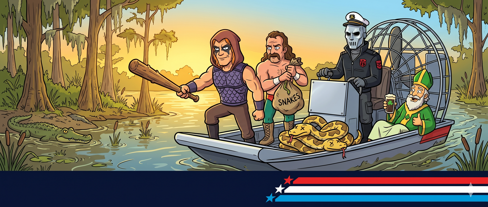
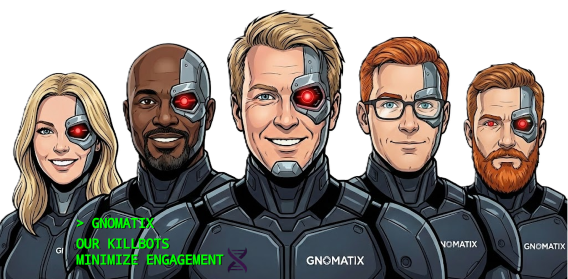

# gnomatix-oss-skills



<!-- BEGIN: gnomatix-promo-include -->
<p>
  <a href="https://www.buymeacoffee.com/gnomatix">
    
  </a>
</p>

<!-- For JS-rendering contexts (the BMC-supplied script tag, preserved as authored):
<script type="text/javascript"
  src="https://cdnjs.buymeacoffee.com/1.0.0/button.prod.min.js"
  data-name="bmc-button"
  data-slug="gnomatix"
  data-color="#BD5FFF"
  data-emoji=""
  data-font="Cookie"
  data-text="Buy me a coffee"
  data-outline-color="#000000"
  data-font-color="#ffffff"
  data-coffee-color="#FFDD00"></script>
-->
<!-- END: gnomatix-promo-include -->

A collection of [Agent Skills](https://agentskills.io) and Claude Code plugins from GNOMATIX. This repo doubles as a Claude Code marketplace, so a single `/plugin marketplace add` covers every plugin housed here.

## Plugins

| Plugin                                                                                          | Description                                                                                                                                                                                                                                                           |
| ----------------------------------------------------------------------------------------------- | --------------------------------------------------------------------------------------------------------------------------------------------------------------------------------------------------------------------------------------------------------------------- |
| [`python-elimination-program`](plugins/python-elimination-program/) | Four coordinated skills (`whacking-day`, `zartan`, `jake-the-snake`, `old-willy`) + a `PreToolUse` firewall hook that prevent AI agents from defaulting to Python in projects where Python is a liability. The three sequential gates control *whether* Python is written; `old-willy` is the merit-rigor test that any "Python is the best tool" claim must survive. |
| [`open-and-honest-agent`](plugins/open-and-honest-agent/)                                       | Agent Skill that forces the agent to externalize its default biases (assumptions, preferences, goals, failure modes, trust model, etc.) as immutable per-session documentation, and log every bias enactment against those documented items proactively by stable ID. |
| [`did-you-rtfm`](plugins/did-you-rtfm/)                                                         | **"Did You READ THE F%CKING MANUAL?!?"** — an Agent Skill (plus two optional Claude Code hooks) that refuses the agent's pivot reflex on errors. Instead of inventing reasons the work can't be done, silently swapping libraries, scoping the feature down, or burying the failure in a `try/except`, the agent must *engineer through*: version-check what's actually in use, read the version-specific authoritative docs, verify its input/output/environment assumptions by direct observation, and build a minimal repro — *before* any "blocker" claim or unauthorized plan change. Plan changes are yours; the agent presents evidence and waits. |

Future plugins drop in as siblings under `plugins/`. Each plugin is self-contained — its own manifest, skills, hooks, and README — so plugins can be lifted into their own repos later without surgery.

## Install

### Claude Code

This repo is a marketplace. Add it once, then install any plugin from it:

```sh
/plugin marketplace add github:gnomatix/gnomatix-oss-skills
/plugin install python-elimination-program@gnomatix-oss-skills
```

`gnomatix-oss-skills` is the marketplace's `name` field in [`.claude-plugin/marketplace.json`](.claude-plugin/marketplace.json) — change it there if you rename. Updates flow via `/plugin update`.

### Other CLIs (cross-CLI Agent Skills standard)

Each plugin's `skills/` subdirectory contains skills in the cross-CLI [Agent Skills](https://agentskills.io) format. The directory structure is:

```
plugins/<plugin-name>/skills/<skill-name>/SKILL.md
```

Per-CLI install pointers (each CLI handles install differently; the *format* is shared):

- **Gemini CLI** — [skills docs](https://geminicli.com/docs/cli/skills/)
- **Kiro** — [skills docs](https://kiro.dev/docs/skills/)
- **Cursor** — [skills docs](https://cursor.com/docs/context/skills)
- **OpenCode** — [skills docs](https://opencode.ai/docs/skills/)
- **OpenAI Codex** — [skills docs](https://developers.openai.com/codex/skills/)
- **GitHub Copilot** — [skills docs](https://docs.github.com/en/copilot/concepts/agents/about-agent-skills)
- **VS Code** — [skills docs](https://code.visualstudio.com/docs/copilot/customization/agent-skills)
- **Goose** — [skills docs](https://block.github.io/goose/docs/guides/context-engineering/using-skills/)

For the full list of compatible CLIs and platforms (~40 and growing), see [agentskills.io](https://agentskills.io).

Hooks are not part of the cross-CLI standard, so the optional firewall hooks shipped under `plugins/<name>/hooks/` only apply to Claude Code.

## Repo layout

```
.
├── .claude-plugin/
│   └── marketplace.json          # marketplace manifest (lists all plugins below)
├── README.md
├── .gitignore
└── plugins/                      # one self-contained subdir per plugin
    ├── python-elimination-program/
    │   ├── .claude-plugin/
    │   │   └── plugin.json
    │   ├── README.md
    │   ├── skills/                # cross-CLI Agent Skills
    │   │   └── <skill-name>/SKILL.md
    │   └── hooks/                 # Claude-Code-only
    │       ├── hooks.json
    │       ├── whacking-day-firewall.js
    │       ├── settings.example.jsonc
    │       └── README.md
    ├── open-and-honest-agent/
    │   ├── .claude-plugin/
    │   │   └── plugin.json
    │   ├── README.md
    │   └── skills/
    │       └── open-and-honest-agent/SKILL.md
    └── did-you-rtfm/
        ├── .claude-plugin/
        │   └── plugin.json
        ├── README.md
        ├── skills/
        │   └── did-you-rtfm/SKILL.md
        └── hooks/                 # Claude-Code-only
            └── ...
```

<!-- BEGIN: gnomatix-license-include -->
## License

**Business Source License 1.1** (BUSL-1.1) — *source-available, not OSI open source*.

The *Additional Use Grant* — the only free-use carve-out — covers:

- **Individual scientists and researchers in the natural sciences, mathematics, engineering, and computer science**, for personal, academic, or non-commercial scientific research use. Social sciences and humanities are *not* covered.
- **Researchers funded by the U.S. NIH (excluding NIAID), NSF, or USDA**, in the course of that funded research. NIAID-funded researchers, other government employees, and other government-funded researchers are *not* covered.
- **Minors** (individuals under the age of 18, or the local age of majority where lower) — any non-commercial personal use.

**All other use requires a commercial license.** This includes any commercial use; organizational, team, or production use; integration into a commercial product; internal use within a for-profit entity; government use outside the NIH-non-NIAID / NSF / USDA carve-out above; NIAID-funded research; social-science or humanities research use; and any adult individual use that is not personal/academic research in the covered disciplines.

Contact [`sales@gnomatix.com`](mailto:sales@gnomatix.com) or reach out via [LinkedIn](https://www.linkedin.com/company/gnomatix) for commercial licensing. General product support: [`support@gnomatix.com`](mailto:support@gnomatix.com).

On the *Change Date* defined in the LICENSE, this code converts automatically to the *Change License* (an OSI-approved open source license) at no further cost to anyone.

See [`LICENSE`](LICENSE) for the full text, including the exact *Additional Use Grant* wording, the covered-disciplines definition, the agency-specific carve-outs and exclusions, the minor-use carve-out, the *Change Date*, and the *Change License* parameters.
<!-- END: gnomatix-license-include -->



> #YoureWelcome
